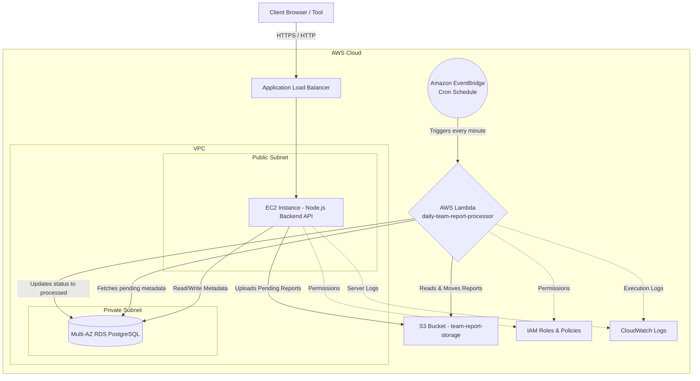

# AWS Architecture Diagram

```mermaid
graph TD
    Client[Client Browser / Tool]
    
    subgraph AWS Cloud
        ALB[Application Load Balancer]
        
        subgraph VPC
            subgraph Public Subnet
                EC2[EC2 Instance - Node.js Backend API]
            end
            
            subgraph Private Subnet
                RDS[(Multi-AZ RDS PostgreSQL)]
            end
        end
        
        S3[S3 Bucket - team-report-storage]
        EventBridge((Amazon EventBridge<br>Cron Schedule))
        Lambda{AWS Lambda<br>daily-team-report-processor}
        IAM[IAM Roles & Policies]
        CW[CloudWatch Logs]
    end
    
    Client -->|HTTPS / HTTP| ALB
    ALB --> EC2
    EC2 -->|Read/Write Metadata| RDS
    EC2 -->|Uploads Pending Reports| S3
    
    EventBridge -->|Triggers every minute| Lambda
    Lambda -->|Fetches pending metadata| RDS
    Lambda -->|Reads & Moves Reports| S3
    Lambda -->|Updates status to processed| RDS
    
    EC2 -.->|Permissions| IAM
    Lambda -.->|Permissions| IAM
    Lambda -.->|Execution Logs| CW
    EC2 -.->|Server Logs| CW
```
