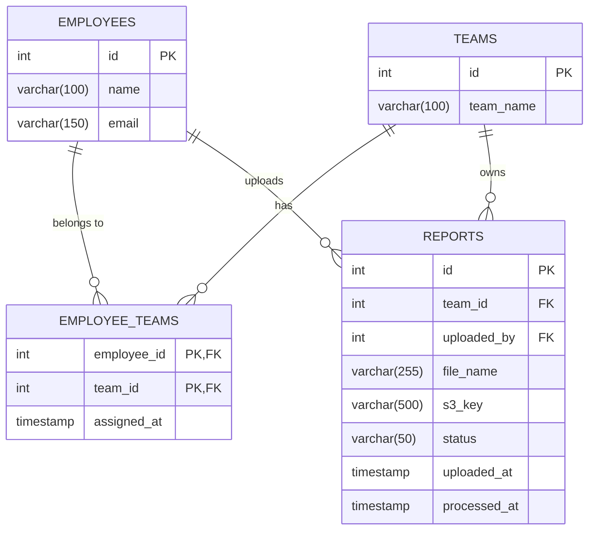

# Entity-Relationship (ER) Diagram

```mermaid
erDiagram
    EMPLOYEES {
        int id PK
        varchar(100) name
        varchar(150) email
    }
    TEAMS {
        int id PK
        varchar(100) team_name
    }
    EMPLOYEE_TEAMS {
        int employee_id PK, FK
        int team_id PK, FK
        timestamp assigned_at
    }
    REPORTS {
        int id PK
        int team_id FK
        int uploaded_by FK
        varchar(255) file_name
        varchar(500) s3_key
        varchar(50) status
        timestamp uploaded_at
        timestamp processed_at
    }

    EMPLOYEES ||--o{ EMPLOYEE_TEAMS : "belongs to"
    TEAMS ||--o{ EMPLOYEE_TEAMS : "has"
    TEAMS ||--o{ REPORTS : "owns"
    EMPLOYEES ||--o{ REPORTS : "uploads"
```
